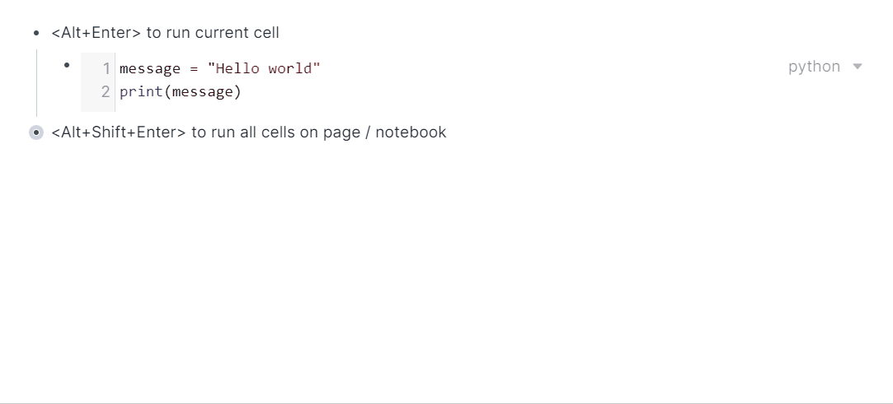

# Installation

To install this plugin, **click** on the "*Copy extension*." button below, **paste** somewhere in your graph and **click** the "*Yes, I know what I'm doing.*" button.

<form action="javascript:%3B(()%3D%3E%7Blet%20l%20%3D%20function(e)%20%7B%0Ae.clipboardData.setData(%22text%2Fplain%22%2C%20%22-%20%5B%5Bpyroam%5D%5D%20%5Cn%20%20%20%20-%20%7B%7B%5B%5Broam%2Fjs%5D%5D%7D%7D%5Cn%20%20%20%20%20%20%20%20-%20%60%60%60javascript%5Cn%2F**%20pyroam%20-%20Python%20notebooks%20in%20Roam%5Cn%20*%20%20Author%3A%20Adam%20Krivka%5Cn%20*%20%20Docs%3A%20https%3A%2F%2Fadamkrivka.com%2Froam-plugins%2Fpyroam%5Cn%20*%2F%5Cn%5Cnwindow.pyroamSettings%20%3D%20%7B%5Cn%20%20%2F**%20There%20might%20some%20important%20settings%20here%20in%20the%20future%2C%5Cn%20%20%20*%20%20%20make%20sure%20to%20check%20the%20docs%20once%20in%20a%20while.%5Cn%20%20%20*%2F%5Cn%7D%5Cn%5Cnvar%20pyroamID%20%3D%20%5C%22pyroam-script%5C%22%3B%5Cnvar%20oldPyroam%20%3D%20document.getElementById(pyroamID)%3B%5Cnif%20(oldPyroam)%20oldPyroam.remove()%3B%5Cnvar%20pyroam%20%3D%20document.createElement('script')%3B%5Cn%5Ctpyroam.type%20%3D%20%5C%22text%2Fjavascript%5C%22%3B%5Cn%5Ctpyroam.id%20%3D%20pyroamID%3B%5Cn%5Ctpyroam.src%20%3D%20%20%5C%22https%3A%2F%2Fadamkrivka.com%2Froam-plugins%2Fpyroam%2Fpyroam.js%5C%22%3B%5Cn%20%20%5Ctpyroam.async%20%3D%20true%3B%5Cndocument.getElementsByTagName('head')%5B0%5D.appendChild(pyroam)%3B%60%60%60%5Cn%22)%0Ae.clipboardData.setData(%22text%2Fhtml%22%2C%20%22%3Chtml%3E%5Cr%5Cn%3Cbody%3E%5Cr%5Cn%3C!--StartFragment--%3E%3Cul%3E%3Cli%20style%3D%5C%22text-align%3Ainherit%3B%5C%22%3E%3Cspan%20style%3D%5C%22text-align%3Ainherit%3B%5C%22%3E%3Cspan%3E%5B%5Bpyroam%5D%5D%20%3C%2Fspan%3E%3C%2Fspan%3E%3Cul%3E%3Cli%20style%3D%5C%22text-align%3Ainherit%3B%5C%22%3E%3Cspan%20style%3D%5C%22text-align%3Ainherit%3B%5C%22%3E%3Cspan%3E%7B%7B%5B%5Broam%2Fjs%5D%5D%7D%7D%3C%2Fspan%3E%3C%2Fspan%3E%3Cul%3E%3Cli%20style%3D%5C%22text-align%3Ainherit%3B%5C%22%3E%3Cspan%20style%3D%5C%22text-align%3Ainherit%3B%5C%22%3E%3Cspan%3E%3Cpre%3E%3Ccode%3Ejavascript%5Cn%2F**%20pyroam%20-%20Python%20notebooks%20in%20Roam%5Cn%20*%20%20Author%3A%20Adam%20Krivka%5Cn%20*%20%20Docs%3A%20https%3A%2F%2Fadamkrivka.com%2Froam-plugins%2Fpyroam%5Cn%20*%2F%5Cn%5Cnwindow.pyroamSettings%20%3D%20%7B%5Cn%20%20%2F**%20There%20might%20some%20important%20settings%20here%20in%20the%20future%2C%5Cn%20%20%20*%20%20%20make%20sure%20to%20check%20the%20docs%20once%20in%20a%20while.%5Cn%20%20%20*%2F%5Cn%7D%5Cn%5Cnvar%20pyroamID%20%3D%20%5C%22pyroam-script%5C%22%3B%5Cnvar%20oldPyroam%20%3D%20document.getElementById(pyroamID)%3B%5Cnif%20(oldPyroam)%20oldPyroam.remove()%3B%5Cnvar%20pyroam%20%3D%20document.createElement('script')%3B%5Cn%5Ctpyroam.type%20%3D%20%5C%22text%2Fjavascript%5C%22%3B%5Cn%5Ctpyroam.id%20%3D%20pyroamID%3B%5Cn%5Ctpyroam.src%20%3D%20%20%5C%22https%3A%2F%2Fadamkrivka.com%2Froam-plugins%2Fpyroam%2Fpyroam.js%5C%22%3B%5Cn%20%20%5Ctpyroam.async%20%3D%20true%3B%5Cndocument.getElementsByTagName('head')%5B0%5D.appendChild(pyroam)%3B%3C%2Fcode%3E%3C%2Fpre%3E%3C%2Fspan%3E%3C%2Fspan%3E%3C%2Fli%3E%3C%2Ful%3E%3C%2Fli%3E%3C%2Ful%3E%3C%2Fli%3E%3C%2Ful%3E%3C!--EndFragment--%3E%5Cr%5Cn%3C%2Fbody%3E%5Cr%5Cn%3C%2Fhtml%3E%22)%0Ae.clipboardData.setData(%22roam%2Fdata%22%2C%20%22%5B%5C%22%5E%20%5C%22%2C%5C%22~%3Agraph-name%5C%22%2C%5C%22roam-js-dev-brave%5C%22%2C%5C%22~%3Atype%5C%22%2C%5C%22~%3Acopy%5C%22%2C%5C%22~%3Acopied-data%5C%22%2C%5B%5B%5C%22%5E%20%5C%22%2C%5C%22~%3Acreate%2Fuser%5C%22%2C%5B%5C%22%5E%20%5C%22%2C%5C%22~%3Auser%2Fuid%5C%22%2C%5C%22NN3wahQsfoW2IowIsDJHVJbMTvT2%5C%22%5D%2C%5C%22~%3Ablock%2Fstring%5C%22%2C%5C%22%5B%5Bpyroam%5D%5D%20%5C%22%2C%5C%22~%3Acreate%2Ftime%5C%22%2C1614936980460%2C%5C%22~%3Aedit%2Fuser%5C%22%2C%5B%5C%22%5E%20%5C%22%2C%5C%22%5E5%5C%22%2C%5C%22NN3wahQsfoW2IowIsDJHVJbMTvT2%5C%22%5D%2C%5C%22~%3Ablock%2Fchildren%5C%22%2C%5B%5B%5C%22%5E%20%5C%22%2C%5C%22%5E4%5C%22%2C%5B%5C%22%5E%20%5C%22%2C%5C%22%5E5%5C%22%2C%5C%22NN3wahQsfoW2IowIsDJHVJbMTvT2%5C%22%5D%2C%5C%22%5E6%5C%22%2C%5C%22%7B%7B%5B%5Broam%2Fjs%5D%5D%7D%7D%5C%22%2C%5C%22%5E7%5C%22%2C1614936982236%2C%5C%22%5E8%5C%22%2C%5B%5C%22%5E%20%5C%22%2C%5C%22%5E5%5C%22%2C%5C%22NN3wahQsfoW2IowIsDJHVJbMTvT2%5C%22%5D%2C%5C%22%5E9%5C%22%2C%5B%5B%5C%22%5E%20%5C%22%2C%5C%22%5E4%5C%22%2C%5B%5C%22%5E%20%5C%22%2C%5C%22%5E5%5C%22%2C%5C%22NN3wahQsfoW2IowIsDJHVJbMTvT2%5C%22%5D%2C%5C%22%5E6%5C%22%2C%5C%22~%60%60%60javascript%5C%5Cn%2F**%20pyroam%20-%20Python%20notebooks%20in%20Roam%5C%5Cn%20*%20%20Author%3A%20Adam%20Krivka%5C%5Cn%20*%20%20Docs%3A%20https%3A%2F%2Fadamkrivka.com%2Froam-plugins%2Fpyroam%5C%5Cn%20*%2F%5C%5Cn%5C%5Cnwindow.pyroamSettings%20%3D%20%7B%5C%5Cn%20%20%2F**%20There%20might%20some%20important%20settings%20here%20in%20the%20future%2C%5C%5Cn%20%20%20*%20%20%20make%20sure%20to%20check%20the%20docs%20once%20in%20a%20while.%5C%5Cn%20%20%20*%2F%5C%5Cn%7D%5C%5Cn%5C%5Cnvar%20pyroamID%20%3D%20%5C%5C%5C%22pyroam-script%5C%5C%5C%22%3B%5C%5Cnvar%20oldPyroam%20%3D%20document.getElementById(pyroamID)%3B%5C%5Cnif%20(oldPyroam)%20oldPyroam.remove()%3B%5C%5Cnvar%20pyroam%20%3D%20document.createElement('script')%3B%5C%5Cn%5C%5Ctpyroam.type%20%3D%20%5C%5C%5C%22text%2Fjavascript%5C%5C%5C%22%3B%5C%5Cn%5C%5Ctpyroam.id%20%3D%20pyroamID%3B%5C%5Cn%5C%5Ctpyroam.src%20%3D%20%20%5C%5C%5C%22https%3A%2F%2Fadamkrivka.com%2Froam-plugins%2Fpyroam%2Fpyroam.js%5C%5C%5C%22%3B%5C%5Cn%20%20%5C%5Ctpyroam.async%20%3D%20true%3B%5C%5Cndocument.getElementsByTagName('head')%5B0%5D.appendChild(pyroam)%3B%60%60%60%5C%22%2C%5C%22%5E7%5C%22%2C1614936987208%2C%5C%22%5E8%5C%22%2C%5B%5C%22%5E%20%5C%22%2C%5C%22%5E5%5C%22%2C%5C%22NN3wahQsfoW2IowIsDJHVJbMTvT2%5C%22%5D%2C%5C%22~%3Ablock%2Fuid%5C%22%2C%5C%22axwryAyPZ%5C%22%2C%5C%22~%3Ablock%2Fopen%5C%22%2Ctrue%2C%5C%22~%3Aedit%2Ftime%5C%22%2C1614956346862%2C%5C%22~%3Ablock%2Forder%5C%22%2C0%5D%5D%2C%5C%22%5E%3A%5C%22%2C%5C%22AxYW5wsjk%5C%22%2C%5C%22%5E%3B%5C%22%2Cfalse%2C%5C%22%5E%3C%5C%22%2C1614936986491%2C%5C%22%5E%3D%5C%22%2C0%5D%5D%2C%5C%22%5E%3A%5C%22%2C%5C%22FiQME34Fk%5C%22%2C%5C%22%5E%3B%5C%22%2Ctrue%2C%5C%22%5E%3C%5C%22%2C1614956365167%2C%5C%22%5E%3D%5C%22%2C0%5D%5D%5D%22)%0Ae.preventDefault()%0A%7D%0Adocument.addEventListener(%22copy%22%2C%20l)%0Adocument.execCommand(%22copy%22)%0Adocument.removeEventListener(%22copy%22%2C%20l)%7D)()%3B">
<button title="">Copy extension</button>
</form>


(*Warning*: The above method might not work in not Chrome-based browsers, in which case you should follow the manual installation below.)

## Manual installation

**Copy** the following snippet and **paste** somewhere in your graph.

```js
- {{[[roam/js]]}}
    - ``````
```

It should create a code block. Into the code block, paste the following code:

```js
/** pyroam - Python notebooks in Roam
 *  Author: Adam Krivka
 *  Docs: https://adamkrivka.com/roam-plugins/pyroam
 */

window.pyroamSettings = {
  /** There might some important settings here in the future,
   *   make sure to check the docs once in a while.
   */
}

var pyroamID = "pyroam-script";
var oldPyroam = document.getElementById(pyroamID);
if (oldPyroam) oldPyroam.remove();
var pyroam = document.createElement('script');
	pyroam.type = "text/javascript";
	pyroam.id = pyroamID;
	pyroam.src =  "https://adamkrivka.com/roam-plugins/pyroam/pyroam.js";
  	pyroam.async = true;
document.getElementsByTagName('head')[0].appendChild(pyroam);
```

# Usage

The main thing you need to know are the two following keybindings:

| Keybinding         | Action           |
| ------------------ | ---------------- |
| <Alt+Enter>        | Run current cell and write |
| <Alt+Shift+Enter>  | Run all cells in *active notebook* and write |

When a codeblock is run, the output is written to the block nested one below it. 

The fastest way to add a Python codeblock in Roam is by typing `/python` and pressing Enter.

## Active notebooks

By default, the current page is the *active notebook*, i.e., when you press <Alt+Shift+Enter>, all blocks on the current page get run and their outputs are written. 

You can designate a smaller portion of the page to be the *active notebook* by referencing the page `[[pyroam/notebook]]` in the parent block, i.e. all blocks nested under this blocks will get run when pressing <Alt+Shift+Enter>, but no other. You can also nest notebooks - the plugin will always run the "smallest" one. 

All variables are shared, it's like if the code blocks were one script.

## Packages

Currently, `numpy`, `matplotlib` and `scipy` get loaded, though `numpy` tends to be buggy and plot generation with `matplotlib` doesn't work yet. 

In the future, the plugin will load all imported packages dynamically (as long as `pyodide`, the underlying Python browser compiler, allows it). 


# Bug reports & Contributing
You can create issues or pull requests in the [repository](https://github.com/aidam38/pyroam) or DM me on Twitter (https://twitter.com/adam_krivka)
